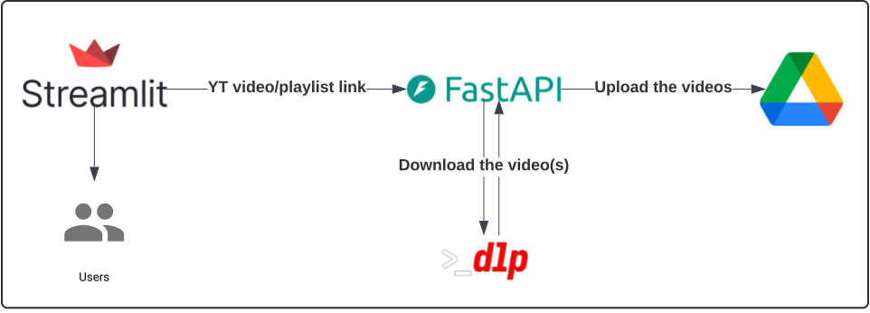

# Technologies

This document outlines the technologies used in the project and the associated design decisions.

### Overview
  - **OAuth2**: Used to manage user authentication. The primary reason for choosing OAuth2 is to leverage Google's user authentication and permissions settings.
  - **FastAPI:** Provides public endpoints to handle the logic for downloading YouTube video(s) and uploading them to Google Drive.
  - **yt-dlp**: Tool for downloading videos and playlists from YouTube.
  - **Streamlit**: Creates a user-friendly web interface.
  - **Google Drive API:** Manages and uploads files to Google Drive.

### User Flow

1. Users interact with the web page by creating an account using Google OAuth, granting permission to write data to Google Drive.
2. Once authenticated, users can add a link to a video or playlist. This request is sent to the backend, which fetches the videos using yt-dlp.
3. The downloaded videos are then uploaded to Google Drive, and a status message is sent to the user.

**Note:** The endpoints are still under development, and the architecture is subject to change. Therefore, detailed endpoint documentation will be provided once the design is finalized.